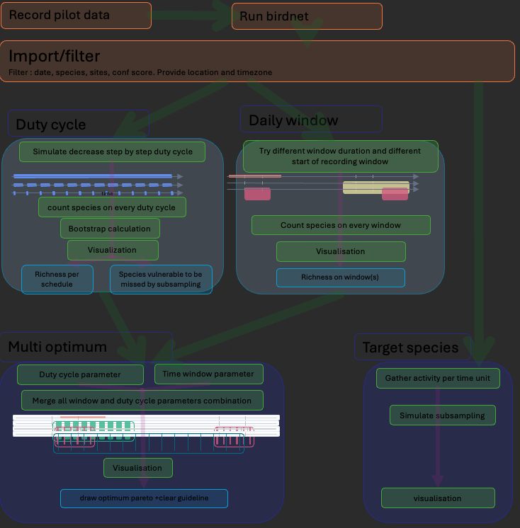
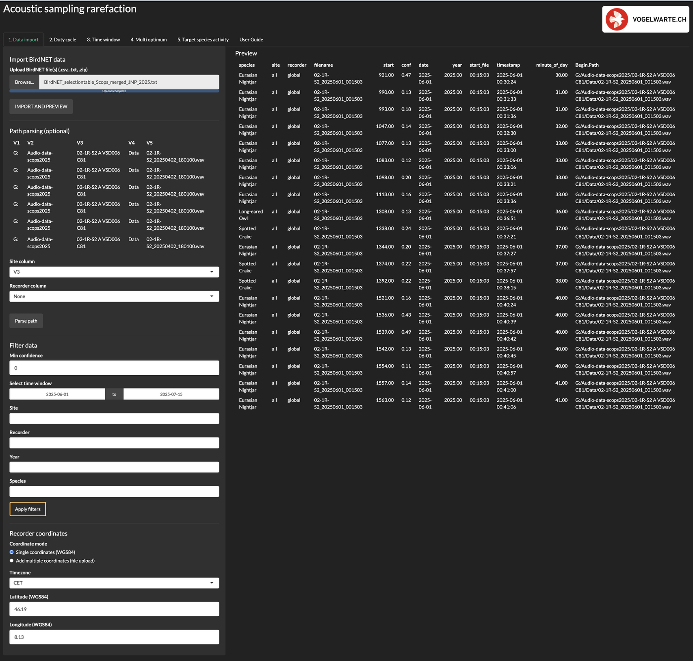
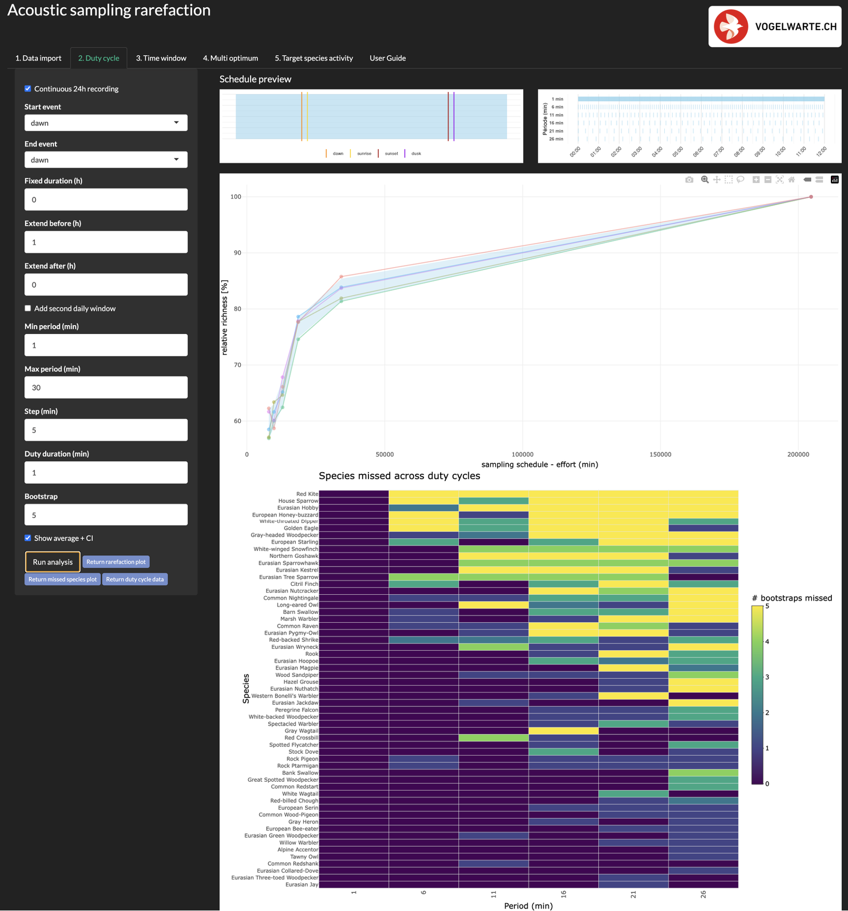
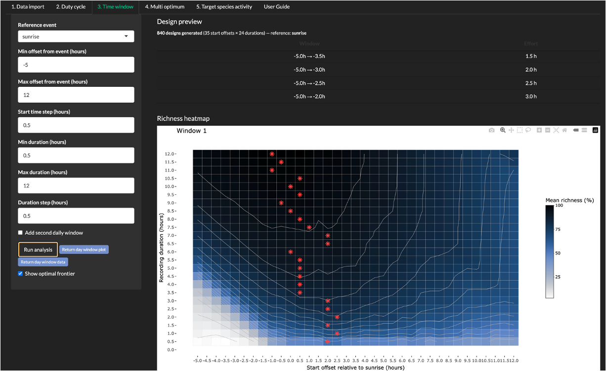
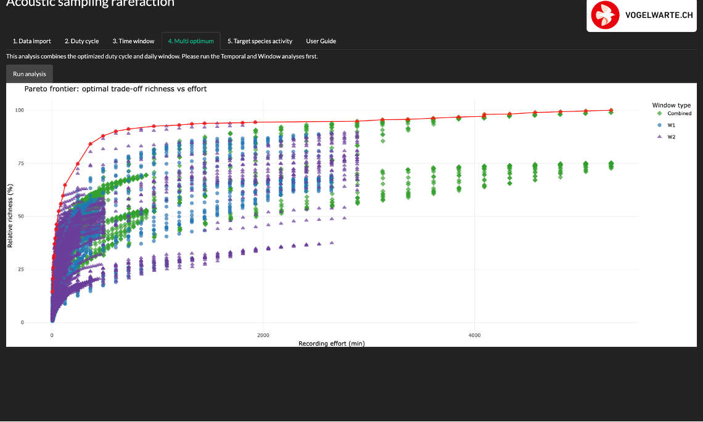
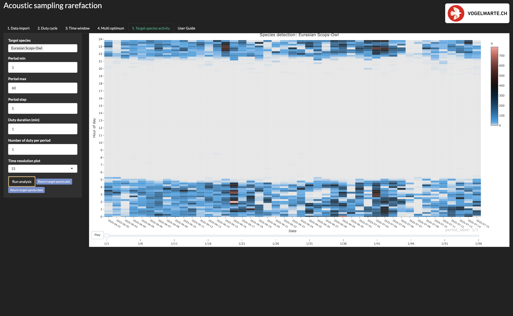

# Bioacoustic tool(s)

This repository hosts Shiny web applications for analyzing and visualizing bird detection results from BirdNET. **SCORE** is a Shiny application designed to evaluate and optimize passive acoustic sampling designs from BirdNET detections.

The app uses an existing BirdNET dataset to simulate how different recording schedules would perform on the same data. It helps users compare sampling effort and species richness under alternative recording schedules. The goal is to support practical decisions on recording protocols while retaining a high proportion of species richness.

The application is intended to be used with a pilot BirdNET detection dataset of a few recording days or longer and for one or several recorders.

## Usage

### Requirements

-   R (version 4.1 or higher)
-   RStudio (recommended)

``` r
# Install required packages
install.packages(c(
  "shiny", "shinythemes", "data.table", "lubridate",
  "ggplot2", "suncalc", "dplyr", "DT", "scico",
  "plotly", "stringr", "readxl"
))
```

To run the App, clone the repository and use the following command in R:

``` r
shiny::runApp("path/to/AppName.R")
```

or open the `app.R` file in RStudio and click "Run App".

### Common Functions

The necessary functions are located in the `R/Functions` folder. They will be sourced automatically when running the App.

## Input format

The app accepts **BirdNET selection table** in **Raven format** output. Files can be `.csv`, `.txt`, or packed into a `.zip` archive containing multiple selection tables. Multiple files are combined automatically.

**Required columns** (BirdNET Raven format defaults, auto-standardised with `make.names()`):

::: {#comment .text style="color: darkred;"}
Add also the non standardised name (like Begin.Time..s.) in the table.
:::

| Column           | Description                                      |
|------------------|--------------------------------------------------|
| `Begin.Path`     | Full path to the source audio file               |
| `Common.Name`    | Species name                                     |
| `Confidence`     | BirdNET confidence score (0–1)                   |
| `Begin.Time..s.` | Detection offset within the audio file (seconds) |

**Coordinate file** (optional, for recorder-specific coordinates): `.csv`, `.txt`, or `.xlsx` with columns `recorder`, `latitude`, `longitude` (WGS84). The `recorder` values must match exactly the names extracted during path parsing. For example:

| recorder | latitude | longitude |
|----------|----------|-----------|
| A        | 47.2090  | 8.1428    |
| B        | 46.2119  | 8.1397    |

## General workflow

**The complete userguide can also be found on the User Guide Tab directly in the App.**

1.  Import and prepare the BirdNET dataset.

2.  Define coordinates and timezone.

3.  Apply the desired filters.

4.  Explore candidate duty-cycle designs.

5.  Explore candidate recording windows.

6.  Compare complete sampling designs in the multi-optimum analysis.

7.  Optionally, visualise activity of one or several target species under different recording schedules.

**In each Tab, you can download data table associated with analysis and each ggplot object separatly using the `ruturn object` buttons. They will appear in the global environement after closing the app.**



## Features

## 1. Data import

### Purpose of the tab

-   Import and prepare the BirdNET detection dataset used in all downstream analyses.
-   BirdNET output is formatted to calculate the timestamp of each detection and to standardise column names.
-   Assign site or recorder labels via path parsing.
-   Filter by date, confidence score, species, recorder, or site.
-   Assign coordinates and timezone to the recording location.

### How to proceed

1.  Browse one or several BirdNET files.

2.  Click **`IMPORT AND PREVIEW`**.

3.  Optional: use the path preview to identify where site and recorder names are stored in the file path. Assign the position of your information (e.g. `V1 = site`).

4.  Select the corresponding path columns and click **`Parse path`**.

5.  Apply the desired filters.

6.  Assign one pair of coordinates for the whole dataset, or upload recorder-specific coordinates. Recorder-specific coordinates must be in a `csv`, `txt`, or `xlsx` file, and the location name must exactly match the name defined during path parsing.

7.  Select the timezone. Coordinates and timezone are used to calculate solar events (`dawn`, `sunrise`, `sunset`, `dusk`).

    <div>

    > **Important**\
    >
    > -   If path parsing is not applied, the same coordinates are used for the whole dataset. This is suitable when all recordings come from the same area, but it may reduce the accuracy of solar-event calculations if recorders are far apart.
    >
    > -   <div>
    >
    >     If path parsing is applied, recorder- or site-specific coordinates must be provided in a multiple-coordinate file. Conversely, if path parsing is not applied, a single pair of coordinates must be used for the whole dataset.
    >
    >     </div>

    </div>



## 2. Duty cycle

### What is a duty cycle?

-   In bioacoustics, a duty cycle is a recording schedule in which the recorder does not run continuously but records at regular intervals — for example 1 min every 5 min, or 10 min every 30 min.

### Purpose of the tab

-   Evaluate how species richness changes under different duty-cycle schedules within the same fixed daily recording window.
-   The user defines a range of duty-cycle values to test, from a minimum to a maximum period.
-   Compare duty-cycle designs by visualising richness retention and recording effort.
-   Identify which species are most likely to be missed under reduced effort.

### User inputs

-   **`Recording window` (left preview):** select a start and end event for the recording window (`dawn`, `sunrise`, `sunset`, `dusk`). Tick `24h recording` if your recorder runs all day.
-   **`Extend before / after`:** shift the window earlier or later relative to the selected solar events.
-   **`Fixed duration`:** if used, the window ends after a fixed number of hours rather than at the end event.
-   **`Second daily window`:** optionally add a second recording window with its own settings.
-   **`Min / Max period (min)`:** the smallest and largest recording interval to test.
-   **`Step (min)`:** the increment between tested period values.
-   **`Duty duration (min)`:** the duration of each individual recording block within a period.
-   **`Bootstrap`:** number of bootstrap replicates used to assess variability across survey days.
-   **`Show average + CI`:** overlay the mean richness-effort curve and its 95% bootstrap confidence band.

> **Example**\
> with `Min = 1`, `Max = 30`, `Step = 5`, `Duty duration = 1`, the app tests: `1 min/1 min`, `1 min/6 min`, `1 min/11 min` … up to `1 min/30 min`.

### Main calculations

-   For each duty-cycle schedule, the app simulates subsampling of the detection data.
-   At every bootstrap iteration, survey days are resampled with replacement and richness is recalculated.
-   Richness is expressed as mean daily richness and standardised to 100% within each replicate.
-   Species detected under each schedule are compared with those from the reference (continuous) schedule in the same replicate.
-   A species is counted as missed if it appears in the reference but not in the tested schedule.

### Outputs

-   **`Richness-effort curve`:** shows how relative richness changes with recording effort. Each curve is one bootstrap replicate; the blue band shows the mean ± 95% CI.

-   **`Missed-species heatmap`:** shows how often each species goes undetected at each duty-cycle setting compared to continuous recording.



## 3. Time window

### Purpose of the tab

-   Evaluate how species richness changes when the recording window is shifted in time and varied in duration.
-   Identify which part of the day or night is most efficient for detecting species.
-   Compare one-window and two-window designs.

### User inputs

-   **`Reference event`:** the anchor for all tested windows (e.g. `dawn`, `sunrise`, or a fixed clock time).
-   **`Min / Max offset`:** range of start times to test relative to the reference event.
-   **`Start time step`:** increment between tested start offsets.
-   **`Min / Max duration`:** range of recording window durations to test.
-   **`Duration step`:** increment between tested durations.
-   **`Window 2`:** optionally add a second window with its own reference event, offset range, and duration range.
-   **`Show optimal frontier`:** highlight the best-performing design for each duration on the heatmap.
-   Note: if `Min offset` is greater than `Max offset` the analysis will return an error. Ensure `Min offset < Max offset`.
-   **`Keep top combined windows`:** limits the number of two-window combinations tested. For each recording duration, the app keeps only the best `N` candidates for `Window 1` and `Window 2`, then combines them.

> **Example**\
> with `12` start offsets × `12` durations gives `144` candidate windows, and with a second similar window, combination gives `144 × 144 = 20 736` possible two-window combinations. Lower values of **`Keep top combined windows`** reduce computation time in the **Time window** and **Multi optimum** tabs, and make the interactive `ggplotly` plots lighter and easier to navigate. Higher values increase computation time, but test more combinations.

### Main calculations

-   A grid of candidate schedules is built from all tested start offsets and durations. The number and parameters of candidate schedules are summarised in the `Design preview` table.
-   For each date, the app simulates subsampling under all candidate schedules and counts distinct species detected.
-   If a schedule crosses midnight, detections from the adjacent day are included.
-   Mean daily richness is standardised to 100% (`= the Window 1 design with the highest mean richness`).
-   If both windows are used, the app also evaluates all pairwise combinations. Combined richness is the union of species detected in both windows, and 100% corresponds to the best combined design.

### Output plots

-   `Window 1` only: a heatmap of richness across start offsets and durations.
-   `Window 2` active: a second heatmap for `Window 2` and a scatter plot of combined two-window richness versus total effort.

> **Important** - This tab identifies efficient recording windows, not duty-cycle designs. - If tested windows extend beyond the real recording coverage of the dataset, richness may be underestimated. - When both windows are active, the number of candidate combined designs grows as the product of all `Window 1` and `Window 2` candidates.



## 4. Multi optimum

### Purpose

-   Combine Duty cycle and Time window results into complete sampling designs (`daily window + duty cycle`).
-   Compare all candidate combinations in terms of richness retention and effort.
-   Identify the Pareto-optimal design: highest richness for a given effort.

### Before running this tab

-   The Duty cycle and Time window computations must be run first.
-   No additional user input is required; candidate schedules are taken from Tabs 2 and 3.

### Main calculations

-   For each candidate time window × duty-cycle combination, the app builds a final schedule by keeping only the duty-cycle blocks that fall inside the selected window(s).
-   Richness is recalculated on these combined schedules.
-   Relative richness is scaled to the maximum richness found across all tested designs.

### Outputs

-   **`Multi-optimum plot`:** all tested combinations in the effort–richness space. Recorder battery life equivalents are shown in the tooltip of Pareto-optimal points.
-   **`Pareto frontier`:** highlighted in red — the set of designs that retain the highest richness for a given recording effort.

> **Important** - This tab is the final decision-support step of the application. - The optimisation criterion is mean daily richness, not cumulative seasonal richness.



------------------------------------------------------------------------

## 5. Target species activity

### Purpose of the tab

-   Visualise the temporal distribution of detections for one or several focal species.
-   Assess how different subsampling regimes interact with the timing of species activity.

### User inputs

-   Select one or several target species.
-   Choose a range of duty-cycle periods to test (same parameters as Tab 2).
-   Choose the time resolution at which detections are aggregated for display.

### Main calculations

-   For each tested duty-cycle period, the app simulates subsampling of the focal species detections.
-   Detections falling into successive time bins across dates are counted.

### Outputs

-   **`Animated heatmap`:** shows how apparent activity patterns change under different subsampling regimes.

> **Important** - This tab is descriptive rather than optimising. - It visualises temporal activity patterns but does not identify optimal richness-effort trade-offs.



------------------------------------------------------------------------

## Acknowledgments

This application is designed to work with output from [BirdNET](https://github.com/kahst/BirdNET-Analyzer), a powerful AI-based bird sound identification system developed by the K. Lisa Yang Center for Conservation Bioacoustics at the Cornell Lab of Ornithology.

Associated manuscript in preparation. Contribution from Amandine Serrurier, Christian Schano, Jean-Nicolas Pradervand, Gabriel Marcacci, Christophe Sahli, Stéphane Aubert, Alain Jacot, Urs G. Kormann
